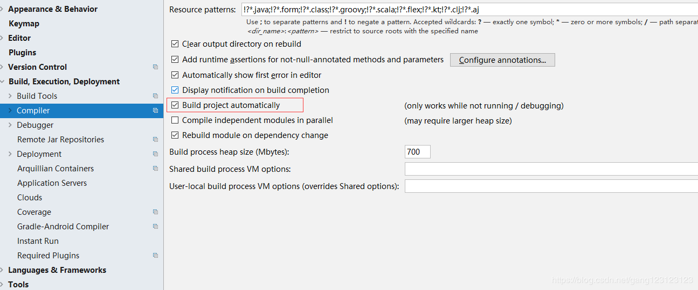

#### spring boot 热部署devtools实现

---

这里是 [原文链接](https://www.cnblogs.com/TechSnail/p/7690829.html)

1. devtools
     spring为开发者提供了一个名为spring-boot-devtools的模块来使Spring Boot应用支持热部署，提高开发者的开发效率，无需手动重启Spring Boot应用。

1. 项目搭建
     本文是采用`IDEA`搭建的`Spring Boot`应用，通过`spring-boot-devtools`配置，可以支持修改java文件会自动重启程序，一些资源无需触发重启。默认情况下，更改`/META-INF/maven`，`/META-INF/resources` ，`/resources` ，`/static` ，`/public`或`/templates`下的资源不会触发重启，而是触发`livereload`。`devtools`模块包含一个嵌入的`livereload`服务器，可以在资源变化时用来触发浏览器刷新。浏览器需要在`livereload.com`下载安装扩展。 例如`Chrome`浏览器在应用商店安装`livereload插件`后，在要自动刷新的页面点击对应的图标，启动应用后更新页面内容或者css等都会触发页面自动刷新。

1. livereload
     `livereload` 通过引入的脚本`livereload.js`在 `livereload` 服务和浏览器之间建立了一个 `WebSocket` 连接。每当监测到文件的变动，`livereload` 服务就会向浏览器发送一个信号，浏览器收到信号后就刷新页面，实现了实时刷新的效果。每次启动时，需要点击对应的图标，如下图所示。

1. 项目代码配置
    (1) pom.xml
  ~~~xml
  <dependency>
     <groupId>org.springframework.boot</groupId>
     <artifactId>spring-boot-devtools</artifactId>
     <optional>true</optional>
  </dependency>
  <plugin>
     <groupId>org.springframework.boot</groupId>
     <artifactId>spring-boot-maven-plugin</artifactId>
     <configuration>
        <fork>true</fork> <!-- 如果没有该配置，devtools不会生效 -->
     </configuration>
  </plugin>
  ~~~
  (2) yml
  ~~~yml
  devtools:
    livereload:
      enabled: true #是否支持livereload
      port: 35729
    restart:
      enabled: true #是否支持热部署
  ~~~
1. IDEA配置
    (1) `File-Settings` - `Compiler-Build` `project automatically`
  

  (2)快捷键：<kbd>ctrl + shift + alt + /</kbd> 选择`Registry`, 勾上 `Compiler autoMake allow when app running`

1. 安装livereload插件
     下载`livereload`插件，将其安装到chrome扩展程序中，并选中**允许访问文件网址**。
1. 测试
     - 修改类 应用会重启
     - 修改配置文件 应用会重启
     - 修改静态文件（html、css等），应用不会重启，但是会调用livereload，浏览器会自动刷新，显示最新的修改内容